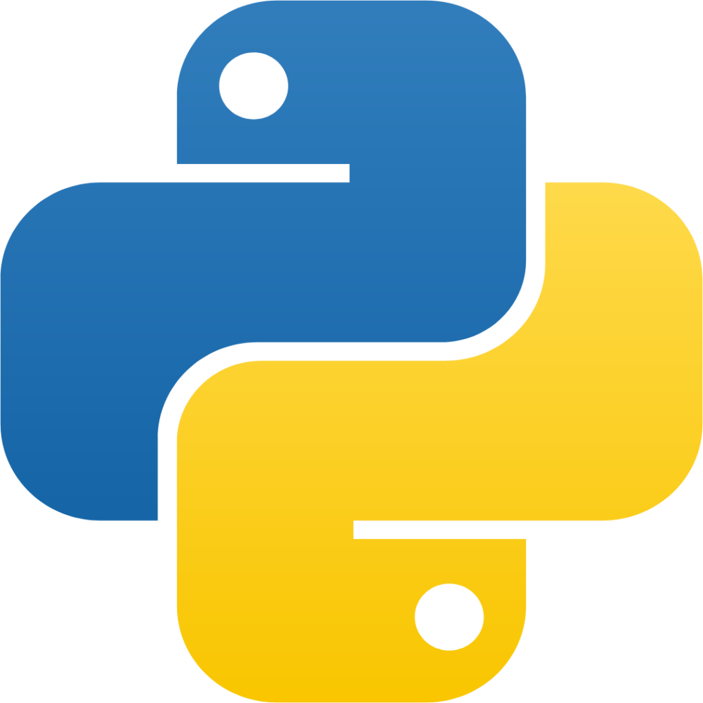
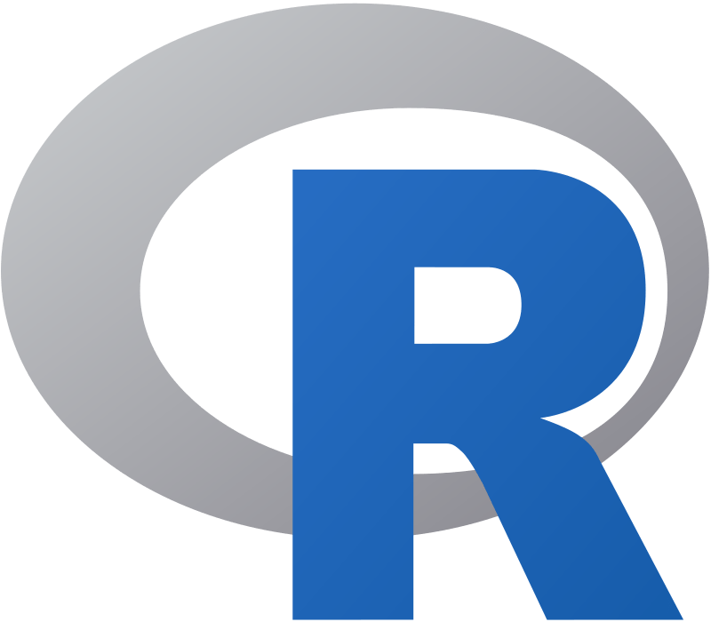
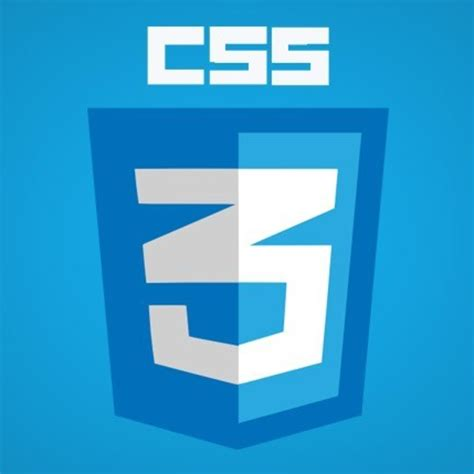
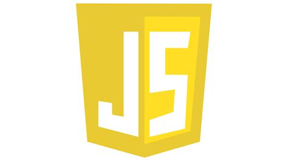
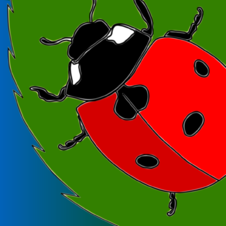
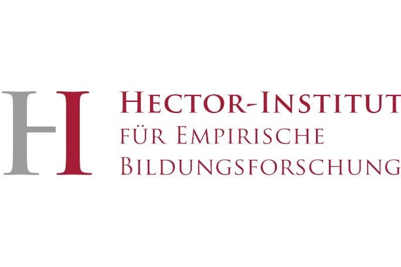
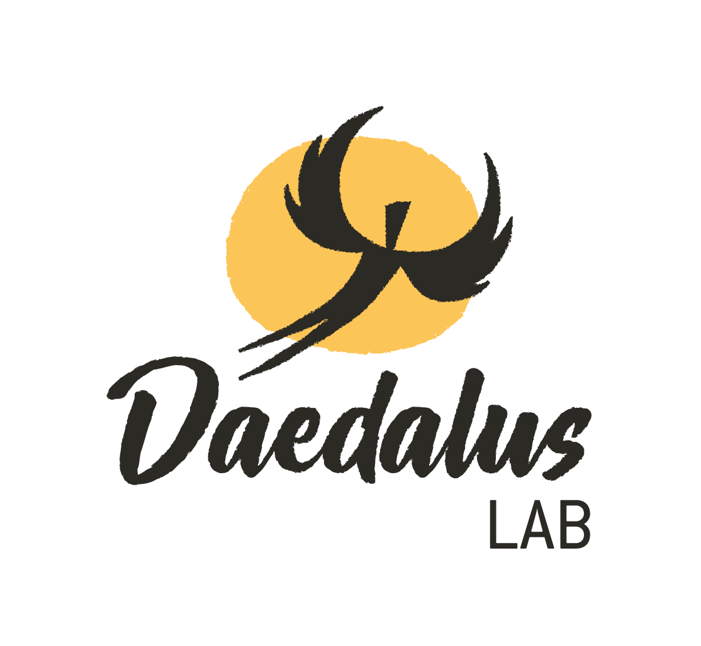

<h1 align="center"> Computational Linguist @ Tübingen </h1>

<h2 align="center">
  
  about me
  
</h2>

> <em>while not success: success = try_again(effort+1)</emp>

***
<h1 align="center"><i>Languages and Tools</i><h1>

  

<!--- 
<h2 align="center">

   

--->

***

<h1 align="center"> Other Skills </h1>

* <b>Building basic Finite State Transducers (FSTs) using regular expressions with hfst-xfst/foma and lexc</b>    

* <b> Problem-solving </b>   

***

<h1 align="center">Experience</h1>

<h2>Student Assistant <mark>(current)</mark> </h2>

<h3>  DSA1, DSA2 and <a href="https://dsacl3-2024.github.io/">DSA3</a> for CL (Computational Linguistics) students </h3>

<h2>HiWi</h2>

<h3>  Build and Annotation of a large corpora for Second Language Acquisition (L2 learners) </h3>

 <em>@HectorResearchInstitute of Education Sciences and Psychology</em> 

<h2>Research Assistant</h2>

<h3>  My work in the lab: <a href="https://github.com/daedalusLAB/speech_analysis">Daedalus Lab/Speech Analysis</a></h3>

***
<h1 align="center"> Upcoming </h1>

1.Internship 🔎
--- 
2.Morphological analyzer for Bulgarian (partial) 🔥 
---
3.Finite-State Spell-Checker  💪
---
4.Personal Webpage  🤖
---
***
