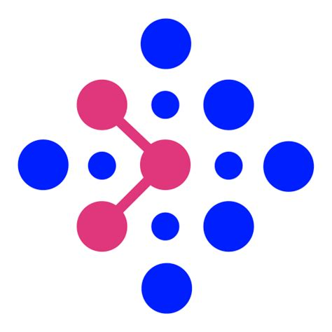

<h1 align="center"> Computational Linguist & Researcher</h1>

<h2 align="center">
  
  <a href="https://mariokuzmanov.github.io/">my webpage</a>
  
</h2>

<!---  --->

> <em>while not success: success = try_again(effort+1)</emp>

***
<h1 align="center"><i>Languages and Tools</i><h1>

  

<!--- 
<h2 align="center">

   

--->

***

<h1 align="center"> Other Skills </h1>

* <b>Building basic Finite State Transducers (FSTs) using regular expressions with hfst-xfst/foma and lexc</b>    

* <b> Problem-solving </b>   

* <b> Literature </b>  
 1. [Speech & Language Processing Book](https://web.stanford.edu/~jurafsky/slp3/) by Jurafsky and Martin
 2. [Deep Learning Book](https://www.deeplearningbook.org/) by Goodfellow, Bengio and Courville

***

<h1 align="center">Experience</h1>

<h2> Intern --> Junior Researcher <mark>(current)</mark> @ Graphwise </h2>

<h3>  Research & Innovation </h3>

 Global Leader in enterprise semantic AI technologies based on knowledge graphs <a href="https://graphwise.ai/">graphwise.ai</a>

<h2>HiWi <mark>(current)</mark> </h2>

<h3>  Effects of labeling a child as gifted based on its' academic and socio-emotional outcomes </h3>

 <em>@HectorResearchInstitute of Education Sciences and Psychology</em> 

<h2> Student Assistant </h2>

<h3>  DSA1, DSA2 and <a href="https://dsacl3-2024.github.io/">DSA3</a> for CL (Computational Linguistics) students 
     
Course Setup/Tutorials for:  <a href="https://snlp1-2024.github.io/">Statistical NLP1</a>  
Course Setup/Tutorials for:  <a href="https://snlp2-2025.github.io/">Statistical NLP2</a>
</h3>

<h2>HiWi</h2>

<h3>  Build and Annotation of a large corpora for Second Language Acquisition (L2 learners) </h3>

 <em>@HectorResearchInstitute of Education Sciences and Psychology</em> 

<h2>Research Assistant</h2>

<h3>  My work in the lab: <a href="https://github.com/daedalusLAB/speech_analysis">Daedalus Lab/Speech Analysis</a></h3>

***
<h1 align="center"> Publications & Awards </h1>

 <i> Graphwise @ CLEF-2025 GutBrainIE: Towards Automated
Discovery of Gut-Brain Interactions - Deep Learning for
NER and Relation Extraction from PubMed Abstracts <a href=https://ceur-ws.org/Vol-4038/paper_14.pdf> (link) </a> </i>

 <i> End-to-End Deep Learning for Named Entity Recognition and Relation
Extraction in Gut-Brain Axis PubMed Abstracts <a href=https://acl-bg.org/proceedings/2025/RANLP%202025/pdf/2025.ranlp-1.31.pdf> (link) </a> </i>

 RANLP 2025 Summer School Task A Winner  

 
***
<h1 align="center"> Upcoming </h1>

1.GutBrainIE 🧠 - coming on GitHub
---
2.Offensive-Language-Detection 🤬🗯️🚫 (competition) - soon on GitHub  
---
3.ASReview LLM screening 🧐📋 - soon on GitHub  
---
4.Updated CV 📝 
---
Transition-based Parser 😎 <mark>(low priority)</mark>
---
Morphological Analyzer for Bulgarian (based on Jurafsky and Martin) 🔥 <mark>(low priority)</mark>
---
***
